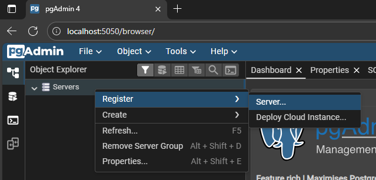
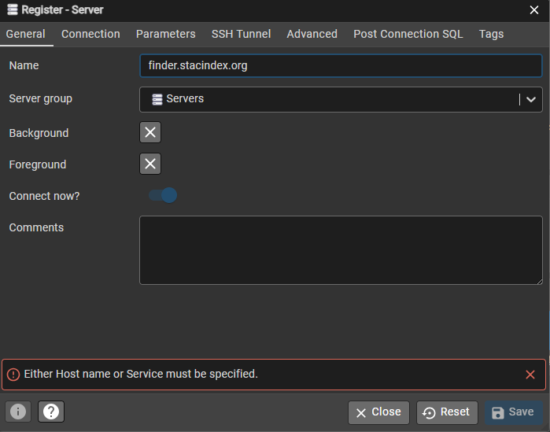
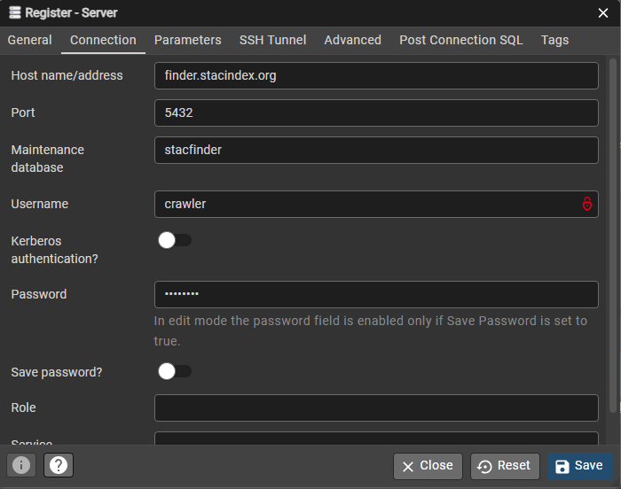
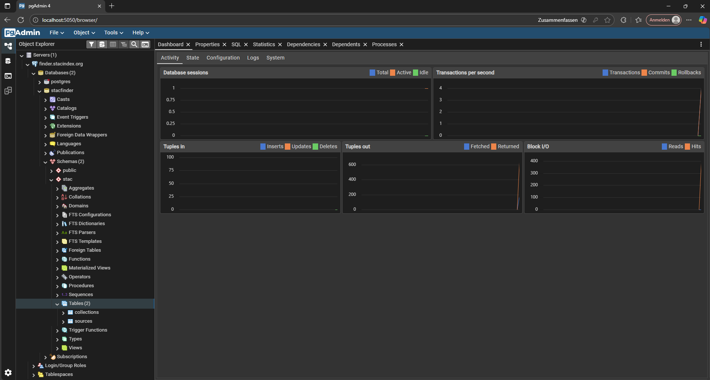

# Database Access Guide

This guide explains how to access and manage the PostgreSQL database with PostGIS extension used by STAC Finder. The database is stored on an external webserver (`finder.stacindex.org`).

## Overview

The project uses **PostgreSQL** with **PostGIS** for storing and querying spatial data. The database runs on an external webserver (`finder.stacindex.org`). For database management, we use **pgAdmin** (Web Interface), which runs in a Docker container and is recommended for visual database administration.

---

## pgAdmin Web Interface

### Access pgAdmin

1. **Start Docker containers:**
   ```bash
   docker-compose up
   ```

2. **Open pgAdmin in your browser:**
   ```
   http://localhost:5050
   ```

### Add PostgreSQL Server (First Time Only)

After logging into pgAdmin:

1. **Right-click on "Servers"** in the left sidebar
2. Select **Register → Server...**



3. **General Tab:**
   - **Name:** `finder.stacindex.org` (or any name you prefer)



4. **Connection Tab:**
   - **Host name/address:** `finder.stacindex.org`
   - **Port:** `5432`
   - **Maintenance database:** `stacfinder`
   - **Username:** `stacapi` or `crawler` (depends ind which component group you are or rights you need)
   - **Password:** (enter the known password)



5. Click **Save**

### What You'll See

After connecting, you can explore:



### Using pgAdmin

- **Create tables:** Right-click on schema → Create → Table
- **Run SQL queries:** Tools → Query Tool
- **View data:** Right-click on table → View/Edit Data
- **Import/Export:** Right-click on table → Import/Export Data

---

## Database Schema

### Available Schemas

- **`public`**: Default PostgreSQL schema
- **`stac`**: Custom schema for STAC-related data (recommended for all project tables)

### PostGIS Extensions

The following PostGIS extensions are pre-installed:
- **`postgis`**: Core spatial data types and functions
- **`postgis_topology`**: Topology support for complex spatial relationships

---

## Additional Resources

- [PostgreSQL Documentation](https://www.postgresql.org/docs/)
- [PostGIS Documentation](https://postgis.net/documentation/)
- [pgAdmin Documentation](https://www.pgadmin.org/docs/)
